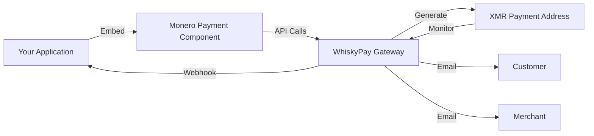

# Monero Integration Guide

This guide provides detailed information about integrating Monero (XMR) payments into your application using WhiskyPay.

## Integration Architecture

The Monero payment integration consists of:

1. **Frontend Component**: React component for displaying the payment UI
2. **Backend Gateway**: Handles payment processing and verification
3. **Webhook Notifications**: Real-time updates about payment status



## Client-Side Integration

### Basic Implementation

The simplest way to integrate Monero payments is using the `MoneroPaymentComponent`:

```jsx
import React from 'react';
import { MoneroPaymentComponent } from 'monero-payment-sdk';

function CheckoutPage() {
  return (
    <div className="container">
      <h1>Complete Your Purchase</h1>
      
      <MoneroPaymentComponent
        gatewayUrl="https://your-gateway-url.com"
        amount={0.01}
        description="Premium Plan Subscription"
        onPaymentComplete={(id) => console.log(`Payment complete: ${id}`)}
        onPaymentError={(error) => console.error('Payment error:', error)}
      />
    </div>
  );
}
```

### Advanced Implementation

For more control over the payment flow, you can use the `MoneroPayment` class directly:

```jsx
import React, { useState, useEffect } from 'react';
import { MoneroPayment } from 'monero-payment-sdk';

function AdvancedCheckout() {
  const [paymentId, setPaymentId] = useState(null);
  const [address, setAddress] = useState(null);
  const [status, setStatus] = useState('idle');
  const [countdown, setCountdown] = useState(0);
  
  // Initialize payment client
  const moneroClient = useMemo(() => 
    new MoneroPayment({ gatewayUrl: 'https://your-gateway-url.com' }),
    []
  );
  
  // Start payment process
  const startPayment = async () => {
    setStatus('creating');
    
    try {
      const { id, address } = await moneroClient.createInvoice({
        amount: 0.01,
        description: 'Premium subscription'
      });
      
      setPaymentId(id);
      setAddress(address);
      setStatus('pending');
      
      // Start checking for payment
      checkPaymentStatus(id);
    } catch (error) {
      setStatus('error');
      console.error('Failed to create invoice:', error);
    }
  };
  
  // Check payment status
  const checkPaymentStatus = async (id) => {
    try {
      const info = await moneroClient.checkInvoice(id);
      setStatus(info.status.toLowerCase());
      
      // Calculate time remaining if there's an expiry
      if (info.expiry) {
        const expiry = new Date(info.expiry);
        const remaining = Math.max(0, Math.floor((expiry.getTime() - Date.now()) / 1000));
        setCountdown(remaining);
      }
      
      // Continue checking if payment is pending
      if (['pending', 'confirming'].includes(info.status.toLowerCase())) {
        setTimeout(() => checkPaymentStatus(id), 10000);
      }
    } catch (error) {
      setStatus('error');
      console.error('Failed to check payment:', error);
    }
  };
  
  // Render component based on status
  return (
    <div className="container">
      <h1>Advanced Checkout</h1>
      
      {status === 'idle' && (
        <button onClick={startPayment}>
          Pay with Monero
        </button>
      )}
      
      {status === 'creating' && <p>Creating payment...</p>}
      
      {status === 'pending' && (
        <div>
          <h2>Payment Pending</h2>
          <p>Send XMR to this address:</p>
          <div className="address-box">{address}</div>
          <button onClick={() => navigator.clipboard.writeText(address)}>
            Copy Address
          </button>
          <p>Time remaining: {Math.floor(countdown / 60)}:{(countdown % 60).toString().padStart(2, '0')}</p>
        </div>
      )}
      
      {status === 'confirming' && (
        <div>
          <h2>Payment Confirming</h2>
          <p>We've detected your payment and are waiting for confirmations.</p>
        </div>
      )}
      
      {status === 'received' && (
        <div>
          <h2>Payment Complete</h2>
          <p>Thank you for your payment!</p>
        </div>
      )}
      
      {status === 'expired' && (
        <div>
          <h2>Payment Expired</h2>
          <p>The payment window has expired.</p>
          <button onClick={startPayment}>
            Try Again
          </button>
        </div>
      )}
      
      {status === 'error' && (
        <div>
          <h2>Payment Error</h2>
          <p>An error occurred processing your payment.</p>
          <button onClick={startPayment}>
            Try Again
          </button>
        </div>
      )}
    </div>
  );
}
```

## Server-Side Integration

### Setting Up the Backend

To fully integrate Monero payments, you'll need server-side components to:

1. Verify payments
2. Process webhooks
3. Update your database
4. Send notifications

Here's an example using Node.js and Express:

```javascript
const express = require('express');
const axios = require('axios');
const crypto = require('crypto');
const router = express.Router();

// Environment variables
const GATEWAY_URL = process.env.GATEWAY_URL;
const API_KEY = process.env.MONERO_API_KEY;
const WEBHOOK_SECRET = process.env.WEBHOOK_SECRET;

// Create a new payment
router.post('/create-payment', async (req, res) => {
  try {
    const { amount, description, customerId, productId } = req.body;
    
    // Validate inputs
    if (!amount || amount <= 0) {
      return res.status(400).json({ error: 'Invalid amount' });
    }
    
    // Create payment with the gateway
    const response = await axios.get(`${GATEWAY_URL}/api/monero/new`, {
      params: { amount, description },
      headers: { 'X-Auth-Token': API_KEY }
    });
    
    const { id, address } = response.data;
    
    // Store payment details in your database
    await db.payments.create({
      paymentId: id,
      customerId,
      productId,
      amount,
      status: 'pending',
      createdAt: new Date()
    });
    
    // Return payment details to the client
    return res.json({ id, address });
  } catch (error) {
    console.error('Error creating payment:', error);
    return res.status(500).json({ error: 'Failed to create payment' });
  }
});

// Check payment status
router.get('/check-payment/:id', async (req, res) => {
  try {
    const { id } = req.params;
    
    // Validate payment ID
    if (!id || id.length !== 16) {
      return res.status(400).json({ error: 'Invalid payment ID' });
    }
    
    // Check payment with the gateway
    const response = await axios.get(`${GATEWAY_URL}/api/monero/info`, {
      params: { id },
      headers: { 'X-Auth-Token': API_KEY }
    });
    
    // Return payment status to the client
    return res.json(response.data);
  } catch (error) {
    console.error('Error checking payment:', error);
    return res.status(500).json({ error: 'Failed to check payment' });
  }
});

// Webhook handler
router.post('/webhook', async (req, res) => {
  try {
    const { id, status, signature, timestamp } = req.body;
    
    // Verify webhook signature
    const expectedSignature = crypto
      .createHmac('sha256', WEBHOOK_SECRET)
      .update(`${id}:${status}:${timestamp}`)
      .digest('hex');
    
    if (signature !== expectedSignature) {
      return res.status(401).json({ error: 'Invalid signature' });
    }
    
    // Update payment status in your database
    await db.payments.update(
      { status },
      { where: { paymentId: id } }
    );
    
    // Handle completed payments
    if (status === 'Received') {
      const payment = await db.payments.findOne({
        where: { paymentId: id }
      });
      
      // Activate the purchased product/service
      await activateProduct(payment.customerId, payment.productId);
      
      // Send confirmation email to customer
      await sendConfirmationEmail(payment.customerId, payment.productId);
    }
    
    return res.status(200).json({ success: true });
  } catch (error) {
    console.error('Error processing webhook:', error);
    return res.status(500).json({ error: 'Failed to process webhook' });
  }
});

module.exports = router;
```

### Database Schema

A basic schema for storing Monero payments:

```sql
CREATE TABLE monero_payments (
  id SERIAL PRIMARY KEY,
  payment_id VARCHAR(16) NOT NULL,
  customer_id VARCHAR(255) NOT NULL,
  product_id VARCHAR(255) NOT NULL,
  amount DECIMAL(16, 12) NOT NULL,
  status VARCHAR(50) NOT NULL,
  address VARCHAR(255) NOT NULL,
  created_at TIMESTAMP NOT NULL,
  updated_at TIMESTAMP NOT NULL
);

CREATE INDEX idx_payment_id ON monero_payments(payment_id);
CREATE INDEX idx_customer_id ON monero_payments(customer_id);
```

## Advanced Features

### Payment Expiration Handling

Monero payments typically have an expiration window. You should implement logic to handle expired payments:

```javascript
// Check for expired payments and clean up
async function handleExpiredPayments() {
  const expiredPayments = await db.payments.findAll({
    where: {
      status: 'pending',
      createdAt: { [Op.lt]: new Date(Date.now() - 30 * 60 * 1000) }
    }
  });
  
  for (const payment of expiredPayments) {
    // Verify with gateway if payment is actually expired
    const response = await axios.get(`${GATEWAY_URL}/api/monero/info`, {
      params: { id: payment.paymentId },
      headers: { 'X-Auth-Token': API_KEY }
    });
    
    if (response.data.status === 'Expired') {
      // Update payment status
      await db.payments.update(
        { status: 'expired' },
        { where: { id: payment.id } }
      );
      
      // Notify customer
      await sendPaymentExpiredEmail(payment.customerId, payment.productId);
    }
  }
}

// Run this job periodically
setInterval(handleExpiredPayments, 15 * 60 * 1000);
```

### Exchange Rate Handling

For applications that price in fiat currencies, implement exchange rate conversion:

```javascript
async function getCurrentXMRRate() {
  const response = await axios.get('https://api.coingecko.com/api/v3/simple/price', {
    params: {
      ids: 'monero',
      vs_currencies: 'usd'
    }
  });
  
  return response.data.monero.usd;
}

async function createPaymentWithFiatAmount(fiatAmount, currency = 'usd') {
  // Get current XMR exchange rate
  const xmrRate = await getCurrentXMRRate();
  
  // Calculate XMR amount with some buffer for rate fluctuations
  const xmrAmount = (fiatAmount / xmrRate) * 1.01; // 1% buffer
  
  // Create payment with XMR amount
  const payment = await createMoneroPayment(xmrAmount);
  
  return {
    ...payment,
    fiatAmount,
    currency,
    exchangeRate: xmrRate
  };
}
```

## Security Considerations

### Securing Your Integration

1. **Validate Webhook Signatures**: Always verify webhook signatures to prevent fraud
2. **API Key Protection**: Store API keys securely as environment variables
3. **Payment Data Validation**: Validate all payment data on both client and server
4. **Address Verification**: Validate Monero addresses using proper regex patterns
5. **Rate Limiting**: Implement rate limiting on payment creation endpoints
6. **SSL/TLS**: Ensure all API communications use HTTPS

### Monero Address Validation

Use proper validation for Monero addresses:

```javascript
function isValidMoneroAddress(address) {
  // Standard Monero address (95 characters)
  const standardRegex = /^4[0-9AB][1-9A-HJ-NP-Za-km-z]{93}$/;
  
  // Integrated address (106 characters)
  const integratedRegex = /^8[0-9AB][1-9A-HJ-NP-Za-km-z]{104}$/;
  
  // Subaddress (95 characters)
  const subaddressRegex = /^8[0-9AB][1-9A-HJ-NP-Za-km-z]{93}$/;
  
  return (
    standardRegex.test(address) ||
    integratedRegex.test(address) ||
    subaddressRegex.test(address)
  );
}
```

## Troubleshooting

### Common Issues and Solutions

| Issue | Possible Cause | Solution |
|-------|---------------|----------|
| Payment not detected | Network delays | Wait for block confirmations |
| Expired payments | Customer took too long | Implement automatic retry flow |
| Gateway connection errors | API key issues | Verify API key and permissions |
| Webhook not received | Incorrect webhook URL | Verify URL in dashboard |
| Payment amount mismatch | Exchange rate fluctuation | Add buffer to XMR amount |

### Debugging Tools

1. **Payment Status Check**: Use the API to check payment status manually
2. **Gateway Logs**: Review logs in the WhiskyPay dashboard
3. **Network Monitoring**: Use block explorers to verify transactions

## Next Steps

- [Explore the complete API reference](/monero/api-reference)
- [Review security best practices](/monero/api-reference#security)
- [Set up automated testing](/monero/api-reference#testing) 