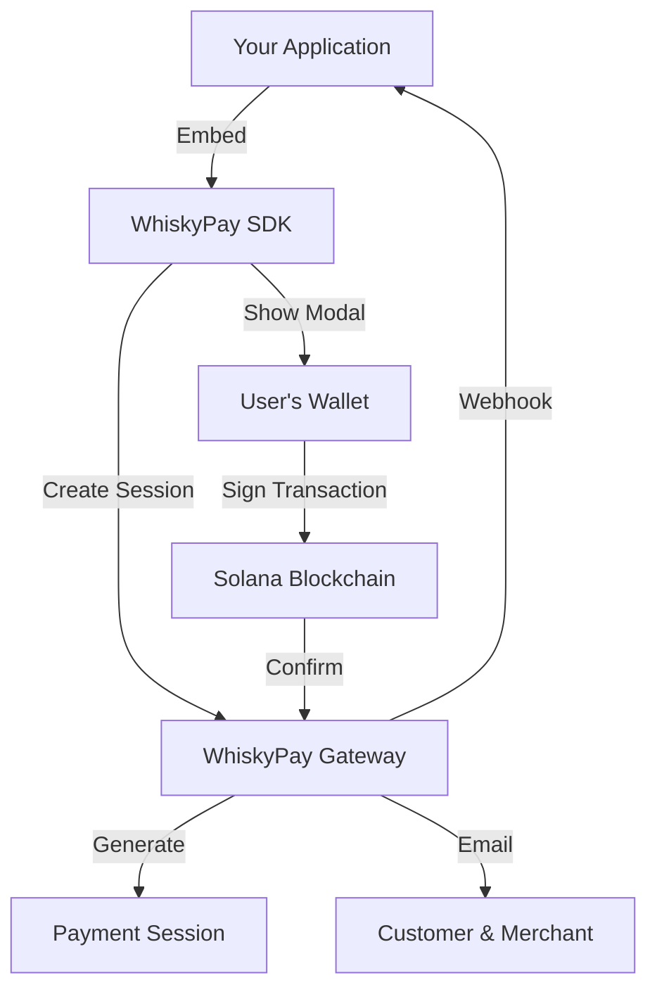

# Solana Integration Guide

This guide provides detailed information about integrating Solana-based cryptocurrency payments into your application using WhiskyPay.

## Integration Architecture

The Solana payment integration consists of:

1. **WhiskyPay SDK**: React components for displaying the payment UI
2. **Payment Gateway**: Handles payment processing and verification
3. **Session Management**: Manages payment sessions and expirations
4. **Token Swaps**: Jupiter integration for accepting any Solana token



## Client-Side Integration

### Basic Implementation

The simplest way to integrate Solana payments is using the `createSession` and `PaymentModal` components:

```jsx
import React, { useState } from 'react';
import { createSession, PaymentModal } from '@whisky-peak/whisky-pay-sdk';

function CheckoutPage() {
  const [sessionId, setSessionId] = useState(null);
  const [loading, setLoading] = useState(false);
  
  const handleCheckout = async () => {
    setLoading(true);
    
    try {
      // Replace with your actual merchant ID
      const merchantId = 'your-merchant-id';
      
      const session = await createSession(
        merchantId,
        'customer@example.com',
        'premium-plan'
      );
      
      if (session) {
        setSessionId(session);
      }
    } catch (error) {
      console.error('Error creating session:', error);
    } finally {
      setLoading(false);
    }
  };
  
  return (
    <div>
      {!sessionId ? (
        <button onClick={handleCheckout} disabled={loading}>
          {loading ? 'Processing...' : 'Pay with Crypto'}
        </button>
      ) : (
        <PaymentModal
          sessionId={sessionId}
          RPC_URL="https://api.mainnet-beta.solana.com"
          onRedirect={() => window.location.href = '/thank-you'}
        />
      )}
    </div>
  );
}
```

### Advanced Implementation with Custom UI

For more control over the payment flow, you can implement a custom UI:

```jsx
import React, { useState, useEffect } from 'react';
import { 
  createSession, 
  getSessionDetails, 
  checkPaymentStatus,
  PaymentStatus
} from '@whisky-peak/whisky-pay-sdk';
import { useWallet } from '@solana/wallet-adapter-react';
import { WalletMultiButton } from '@solana/wallet-adapter-react-ui';

function CustomCheckout() {
  const [sessionId, setSessionId] = useState(null);
  const [sessionDetails, setSessionDetails] = useState(null);
  const [status, setStatus] = useState('idle');
  const [loading, setLoading] = useState(false);
  const [error, setError] = useState(null);
  const { publicKey, sendTransaction } = useWallet();
  
  // Create a new payment session
  const createPaymentSession = async () => {
    setLoading(true);
    setError(null);
    
    try {
      const session = await createSession(
        'your-merchant-id',
        'customer@example.com',
        'premium-plan'
      );
      
      setSessionId(session);
      
      // Fetch session details
      const details = await getSessionDetails(session);
      setSessionDetails(details);
      setStatus('session_created');
    } catch (error) {
      console.error('Error creating session:', error);
      setError('Failed to create payment session');
    } finally {
      setLoading(false);
    }
  };
  
  // Process payment when wallet is connected
  const processPayment = async () => {
    if (!publicKey || !sessionId || !sessionDetails) {
      return;
    }
    
    setStatus('processing');
    setError(null);
    
    try {
      // Create the transaction
      const { transaction, status } = await prepareTransaction(
        sessionId,
        publicKey.toString(),
        'SOL' // Token to pay with
      );
      
      if (status === 'ready') {
        // Send transaction to wallet for signing
        const signature = await sendTransaction(transaction, 'finalized');
        
        // Check payment status periodically
        const intervalId = setInterval(async () => {
          const result = await checkPaymentStatus(sessionId);
          
          if (result.status === PaymentStatus.COMPLETED) {
            clearInterval(intervalId);
            setStatus('completed');
          } else if (result.status === PaymentStatus.FAILED) {
            clearInterval(intervalId);
            setStatus('failed');
            setError(result.message || 'Payment failed');
          }
        }, 3000);
      }
    } catch (error) {
      console.error('Error processing payment:', error);
      setStatus('failed');
      setError('Failed to process payment');
    }
  };
  
  // Render UI based on status
  return (
    <div className="custom-checkout">
      <h1>Checkout</h1>
      
      {status === 'idle' && (
        <div>
          <button 
            onClick={createPaymentSession}
            disabled={loading}
          >
            {loading ? 'Creating Session...' : 'Checkout Now'}
          </button>
        </div>
      )}
      
      {status === 'session_created' && (
        <div>
          <h2>Payment Details</h2>
          <p>Amount: {sessionDetails.amount} {sessionDetails.currency}</p>
          <p>Plan: {sessionDetails.planId}</p>
          
          {!publicKey ? (
            <div>
              <p>Connect your wallet to continue:</p>
              <WalletMultiButton />
            </div>
          ) : (
            <button onClick={processPayment}>
              Pay Now
            </button>
          )}
        </div>
      )}
      
      {status === 'processing' && (
        <div>
          <h2>Processing Payment</h2>
          <p>Please confirm the transaction in your wallet.</p>
          <div className="spinner"></div>
        </div>
      )}
      
      {status === 'completed' && (
        <div>
          <h2>Payment Complete!</h2>
          <p>Thank you for your purchase.</p>
          <button onClick={() => window.location.href = '/dashboard'}>
            Go to Dashboard
          </button>
        </div>
      )}
      
      {status === 'failed' && (
        <div>
          <h2>Payment Failed</h2>
          <p>Error: {error}</p>
          <button onClick={createPaymentSession}>
            Try Again
          </button>
        </div>
      )}
    </div>
  );
}
```

## Server-Side Integration

### Setting Up Webhooks

To handle payment notifications, set up a webhook endpoint in your backend:

```javascript
// Next.js API route (pages/api/webhooks/payment.js)
import { createHmac } from 'crypto';

export default async function handler(req, res) {
  if (req.method !== 'POST') {
    return res.status(405).json({ error: 'Method not allowed' });
  }
  
  // Get the raw request body for signature verification
  const body = req.body;
  const signature = req.headers['x-whiskypay-signature'];
  
  // Verify the webhook signature
  const expectedSignature = createHmac('sha256', process.env.WEBHOOK_SECRET)
    .update(JSON.stringify(body))
    .digest('hex');
  
  if (signature !== expectedSignature) {
    return res.status(401).json({ error: 'Invalid signature' });
  }
  
  // Process the webhook payload
  const { 
    sessionId, 
    customerId, 
    planId, 
    status, 
    amount, 
    currency,
    timestamp
  } = body;
  
  try {
    // Update database with payment information
    if (status === 'completed') {
      await db.payments.create({
        sessionId,
        customerId,
        planId,
        amount,
        currency,
        status: 'completed',
        completedAt: new Date(timestamp)
      });
      
      // Activate user's subscription
      await activateSubscription(customerId, planId);
      
      // Send confirmation email
      await sendPaymentConfirmation(customerId, planId, amount, currency);
    }
    
    // Acknowledge receipt of webhook
    return res.status(200).json({ received: true });
  } catch (error) {
    console.error('Error processing webhook:', error);
    return res.status(500).json({ error: 'Failed to process webhook' });
  }
}
```

### Payment Status Verification

You can verify payment status server-side using the WhiskyPay API:

```javascript
// Server-side payment verification
const axios = require('axios');

async function verifyPayment(sessionId) {
  try {
    const response = await axios.get(
      `https://api.whiskypeak.com/v1/sessions/${sessionId}`,
      {
        headers: {
          'Authorization': `Bearer ${process.env.WHISKYPAY_API_KEY}`
        }
      }
    );
    
    return {
      verified: response.data.status === 'completed',
      details: response.data
    };
  } catch (error) {
    console.error('Error verifying payment:', error);
    throw new Error('Failed to verify payment');
  }
}
```

### Database Schema

A basic schema for storing payments:

```sql
CREATE TABLE payments (
  id SERIAL PRIMARY KEY,
  session_id VARCHAR(255) NOT NULL UNIQUE,
  customer_id VARCHAR(255) NOT NULL,
  plan_id VARCHAR(255) NOT NULL,
  amount DECIMAL(18, 8) NOT NULL,
  currency VARCHAR(10) NOT NULL,
  status VARCHAR(50) NOT NULL,
  created_at TIMESTAMP DEFAULT CURRENT_TIMESTAMP,
  completed_at TIMESTAMP,
  CONSTRAINT uk_session_id UNIQUE (session_id)
);

CREATE TABLE subscriptions (
  id SERIAL PRIMARY KEY,
  customer_id VARCHAR(255) NOT NULL,
  plan_id VARCHAR(255) NOT NULL,
  status VARCHAR(50) NOT NULL,
  payment_id INTEGER REFERENCES payments(id),
  starts_at TIMESTAMP NOT NULL,
  ends_at TIMESTAMP NOT NULL,
  created_at TIMESTAMP DEFAULT CURRENT_TIMESTAMP
);
```

## Advanced Features

### Multi-Currency Support

WhiskyPay supports multiple tokens on Solana. You can specify a preferred token:

```jsx
<PaymentModal
  sessionId={sessionId}
  RPC_URL="https://api.mainnet-beta.solana.com"
  onRedirect={handlePaymentComplete}
  desiredToken="USDC" // Preferred token: USDC, SOL, BONK, etc.
/>
```

### Subscription Management

For recurring payments, implement a subscription management system:

```javascript
// Create a subscription record
async function createSubscription(customerId, planId, paymentId) {
  // Calculate subscription period based on plan
  const planDetails = await getSubscriptionPlan(planId);
  
  const startDate = new Date();
  const endDate = new Date();
  
  // Set end date based on billing period
  switch (planDetails.billingCycle) {
    case 'monthly':
      endDate.setMonth(endDate.getMonth() + 1);
      break;
    case 'quarterly':
      endDate.setMonth(endDate.getMonth() + 3);
      break;
    case 'yearly':
      endDate.setFullYear(endDate.getFullYear() + 1);
      break;
    default:
      throw new Error('Invalid billing cycle');
  }
  
  // Create subscription record
  await db.subscriptions.create({
    customerId,
    planId,
    status: 'active',
    paymentId,
    startsAt: startDate,
    endsAt: endDate
  });
  
  // Schedule renewal notification
  const reminderDate = new Date(endDate);
  reminderDate.setDate(reminderDate.getDate() - 7); // 7 days before expiry
  
  await scheduleRenewalReminder(customerId, planId, reminderDate);
}

// Check for expiring subscriptions daily
async function processExpiringSubscriptions() {
  const today = new Date();
  const nextWeek = new Date();
  nextWeek.setDate(nextWeek.getDate() + 7);
  
  // Find subscriptions expiring in the next week
  const expiringSubscriptions = await db.subscriptions.findAll({
    where: {
      status: 'active',
      endsAt: {
        $gte: today,
        $lte: nextWeek
      }
    }
  });
  
  for (const subscription of expiringSubscriptions) {
    await sendRenewalReminder(
      subscription.customerId,
      subscription.planId,
      subscription.endsAt
    );
  }
}
```

### Token Price Conversion

To handle price conversion between tokens:

```javascript
async function getTokenPriceInUSD(tokenSymbol) {
  try {
    const response = await axios.get('https://price-api.crypto.com/price/v1/exchange/solana', {
      params: {
        instrument_name: `${tokenSymbol}_USD`
      }
    });
    
    return response.data.data.i;
  } catch (error) {
    console.error(`Error fetching ${tokenSymbol} price:`, error);
    throw new Error(`Failed to get ${tokenSymbol} price`);
  }
}

async function calculateTokenAmount(usdAmount, tokenSymbol) {
  const tokenPrice = await getTokenPriceInUSD(tokenSymbol);
  const tokenAmount = usdAmount / tokenPrice;
  
  // Add a small buffer for price fluctuations (1%)
  const bufferedAmount = tokenAmount * 1.01;
  
  return bufferedAmount;
}
```

## Security Considerations

### Securing Your Integration

1. **Verify Webhook Signatures**: Always validate webhooks to prevent fraud
2. **Store API Keys Securely**: Use environment variables for API keys
3. **Implement Rate Limiting**: Prevent abuse of your payment endpoints
4. **Transaction Verification**: Always verify transactions on-chain
5. **Double-Spending Protection**: Check for duplicate transaction signatures

### Protecting User Data

```javascript
// Encrypt sensitive customer data
const crypto = require('crypto');

function encryptData(data, encryptionKey) {
  const iv = crypto.randomBytes(16);
  const cipher = crypto.createCipheriv('aes-256-cbc', Buffer.from(encryptionKey, 'hex'), iv);
  
  let encrypted = cipher.update(JSON.stringify(data));
  encrypted = Buffer.concat([encrypted, cipher.final()]);
  
  return {
    iv: iv.toString('hex'),
    data: encrypted.toString('hex')
  };
}

function decryptData(encryptedData, encryptionKey) {
  const decipher = crypto.createDecipheriv(
    'aes-256-cbc', 
    Buffer.from(encryptionKey, 'hex'), 
    Buffer.from(encryptedData.iv, 'hex')
  );
  
  let decrypted = decipher.update(Buffer.from(encryptedData.data, 'hex'));
  decrypted = Buffer.concat([decrypted, decipher.final()]);
  
  return JSON.parse(decrypted.toString());
}
```

## Troubleshooting

### Common Issues and Solutions

| Issue | Possible Cause | Solution |
|-------|---------------|----------|
| Transaction rejected | Insufficient balance | Verify wallet has enough funds |
| Wallet connection fails | Wrong network | Ensure wallet is on Solana mainnet |
| Payment not confirmed | Network congestion | Wait for confirmation or retry |
| Session expired | Timeout exceeded | Create a new session |
| Webhook not received | Incorrect URL | Verify webhook URL in dashboard |

### Debugging Tools

1. **Session Details**: Get session information using the API
2. **Transaction Explorer**: Use Solana Explorer to check transactions
3. **Gateway Logs**: Review logs in the WhiskyPay dashboard

## Best Practices

1. **Always Verify Payments**: Cross-check webhook notifications with the API
2. **Handle Edge Cases**: Implement proper error handling and retries
3. **Test Thoroughly**: Test all payment flows before going live
4. **Monitor Transactions**: Set up alerts for failed payments
5. **Keep SDK Updated**: Regularly update to the latest SDK version

## Next Steps

- [Explore the complete API reference](/solana/api-reference)
- [Set up custom payment flows](/solana/api-reference#custom-flows)
- [Implement advanced analytics](/solana/api-reference#analytics) 